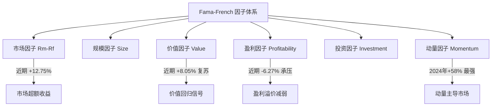
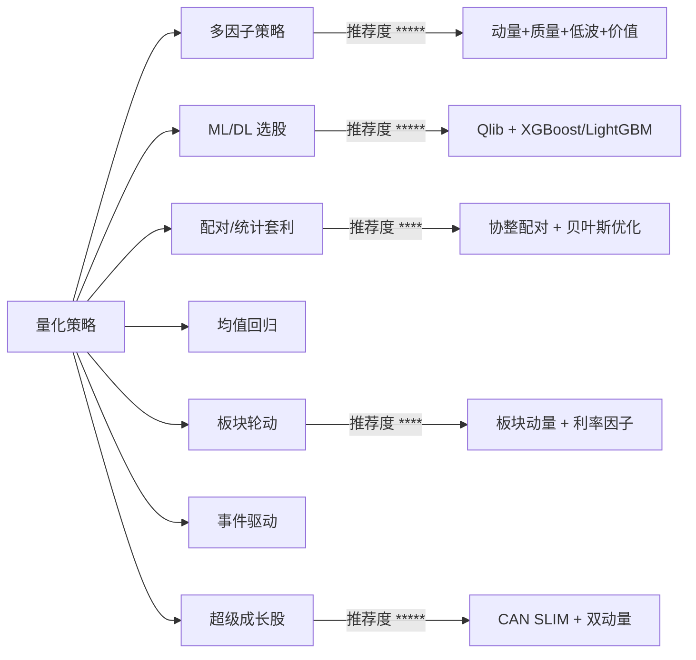
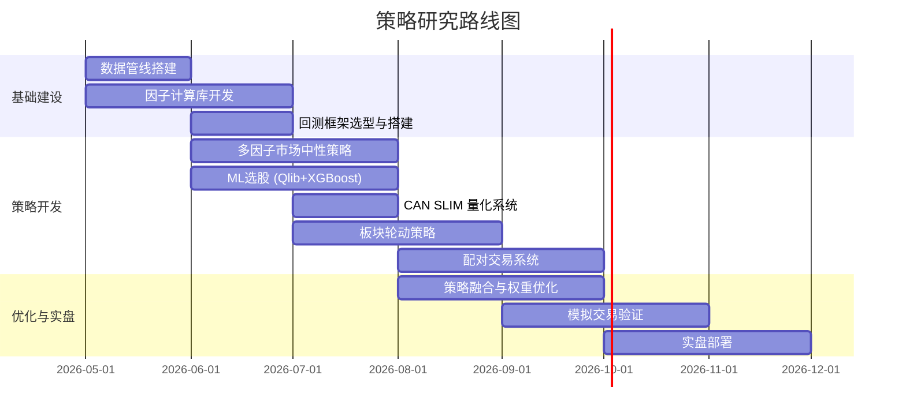

# 策略知识图谱

> 维护者：首席因子猎手  
> 更新日期：2026-05-17  
> 说明：策略研究部核心知识体系，涵盖因子、策略、工具、数据源、文献等

---

## 一、因子体系

### 1.1 经典因子（Fama-French 体系）



### 1.2 Alpha 因子分类

| 类别 | 子类 | 代表因子 | 来源 |
|------|------|---------|------|
| **技术因子** | 动量 | 12M-1M 动量、3M 动量、RS 相对强度 | Qlib Alpha158 |
| | 反转 | 短期反转、均值回归 Z-score | 统计套利 |
| | 波动率 | ATR、Bolinger Bands、VIX | 风险因子 |
| | 成交量 | OBV、成交量变化率、换手率 | 情绪因子 |
| **基本面因子** | 成长 | 营收增速、EPS 增速、盈利惊喜 | CAN SLIM |
| | 质量 | ROE、ROA、毛利率、FCF 收益率 | QUAL ETF |
| | 价值 | PE、PB、PCF、股息率 | HML |
| | 安全 | D/E 比率、利息覆盖倍数 | 风险控制 |
| **另类因子** | 情绪 | 机构持仓变化、内部人交易 | 行为金融 |
| | 宏观 | 利率敏感性、通胀对冲力 | 宏观因子 |

### 1.3 因子表现周期 (2024-2025 观测)

```
2024:  Momentum >>> Growth > Quality > Value > Low Vol
2025 Q1-Q2: Low Vol > Value > Momentum > Growth > Quality  
2025 Q3:   Momentum > Growth > Value > Quality > Low Vol
2025 Q4:   Low Vol/Defensive > Momentum > Value > Growth
```

---

## 二、策略体系

### 2.1 策略地图



### 2.2 策略参数速查

| 策略 | Sharpe 预期 | 最大回撤 | 容量 | 复杂度 | 换手率 |
|------|-----------|---------|------|--------|--------|
| 多因子市场中性 | 1.0-1.5 | 5-10% | 大 | 中 | 中 |
| ML 选股 (Qlib) | 0.8-1.85 | 10-15% | 中-大 | 中-高 | 中-高 |
| CAN SLIM 成长股 | 0.8-1.3 | 15-25% | 中 | 中 | 高 |
| 板块轮动 | 0.7-1.2 | 8-12% | 极大 | 低-中 | 低-中 |
| 配对交易 | 1.0-1.5 | 5-8% | 小-中 | 高 | 高 |
| 均值回归 | 0.5-1.0 | 10-20% | 中 | 低-中 | 高 |

---

## 三、工具栈

### 3.1 数据源

| 数据源 | 覆盖范围 | 价格 | 推荐场景 |
|--------|---------|------|---------|
| **Polygon.io** | 美股 + 期权 + 加密货币 | $29-$199/月 | 主力数据源，分钟级数据 |
| **Yahoo Finance (yfinance)** | 全球股票 | 免费 | 原型开发/小规模回测 |
| **FRED** | 宏观经济数据 | 免费 | 宏观因子构建 |
| **Kenneth French Data Library** | 因子收益数据 | 免费 | 因子研究基准 |
| **Quandl / Nasdaq Data Link** | 基本面/另类数据 | 付费 | 高级因子挖掘 |

### 3.2 核心框架

| 框架 | 用途 | 优势 | 劣势 |
|------|------|------|------|
| **Qlib (微软)** | 全流程量化平台 | 因子库丰富(158/360), 20+模型 | A 股偏重，需适配美股 |
| **Backtrader** | 回测框架 | 成熟稳定, 社区大 | 速度较慢 |
| **QuantConnect (LEAN)** | 云回测+实盘 | C#核心, 性能好 | 学习曲线陡 |
| **LumiBot** | Python 回测 | Polygon.io 原生支持 | 相对较新 |
| **VectorBT** | 向量化回测 | 极速回测 | 偏重 ETF |

### 3.3 ML/DL 工具

| 工具 | 适用场景 | 特点 |
|------|---------|------|
| **XGBoost** | 分类/回归, 因子排名 | 最稳定, R² 可达 99% |
| **LightGBM** | 大规模因子训练 | 训练速度比 XGBoost 快 |
| **CatBoost** | 类别特征处理 | 有序提升, 泛化好 |
| **PyTorch LSTM** | 时间序列预测 | 局部时序模式 |
| **PyTorch Transformer** | 长序列预测 | 注意力机制捕获长期依赖 |
| **scikit-learn** | 特征工程 + 基础模型 | Pipeline 标准化 |

### 3.4 绩效评估

| 工具 | 功能 | 推荐度 |
|------|------|--------|
| **QuantStats** | 综合绩效报告 (HTML) | ⭐⭐⭐⭐⭐ |
| **pyfolio** | 因子分析 + 绩效归因 | ⭐⭐⭐⭐ |
| **Alphalens** | 因子 IC 分析 | ⭐⭐⭐⭐ |
| **Deflated Sharpe Ratio** | 过拟合检验 | ⭐⭐⭐⭐⭐ |

---

## 四、超级成长股筛选知识体系

### 4.1 CAN SLIM 七要素

```
C — Current Earnings: EPS ≥ 25% YoY
A — Annual Earnings: 3年 CAGR ≥ 25%, ROE ≥ 17%
N — New: 新产品/新高/新管理层
S — Supply: 流通盘小, 上涨放量
L — Leader: RS ≥ 80, 行业龙头
I — Institutional: 机构持仓, 但<85%
M — Market: 市场确认上涨趋势
```

### 4.2 双动量框架

```
双动量得分 = α × 基本面动量排名 + β × 价格动量排名
其中: α = β = 0.5 (等权)
基本面动量 = f(EPS增长, ROE, ROA, 现金流盈利能力, 毛利率, 净支付率)
价格动量 = 过去12个月收益 - 最近1个月收益
最终选择: 综合排名 Top 5%
```

### 4.3 三级漏斗筛选

```
第一级: 全市场粗筛 (保留 2-3%)
  ├─ 市值 > $3亿
  ├─ 营收增速 > 20% YoY
  ├─ EPS 增速 > 20% YoY
  └─ 股价 > $10

第二级: 多因子打分 (保留 Top 20%)
  ├─ 动量因子 25% | 质量因子 25%
  ├─ 成长因子 25% | 技术因子 15%
  └─ 情绪因子 10%

第三级: ML 预测确认 (保留 Top 5%)
  └─ Qlib Alpha158 + XGBoost 预测排名
```

---

## 五、文献与参考

### 5.1 核心论文

| 论文 | 年份 | 核心贡献 | 链接 |
|------|------|---------|------|
| Fama-French 五因子模型 | 2015 | 在 CAPM 三因子基础上增加盈利和投资因子 | mba.tuck.dartmouth.edu |
| Beyond the Last Surprise (PEAD+ML) | 2025 | ML 增强多季度盈利惊喜, Sharpe 0.34→0.63 | ScienceDirect |
| Gradient Boosting + LSTM (IEEE) | 2025 | LSTM+LightGBM+CatBoost 集成, 提升 10-15% | arXiv |
| Drift Regime Factor (Sharpe 13+) | 2025 | 漂移状态下的价值+反转因子 | arXiv |
| FF5 + VIX + Overnight Returns | 2025 | R² 0.228→0.540 提升一倍 | ACM |

### 5.2 必读 GitHub 项目

| 项目 | Stars(约) | 推荐理由 |
|------|----------|---------|
| microsoft/qlib | 15k+ | AI 量化平台, 因子库+回测 |
| QuantEdge | — | 市场中性, Sharpe 1.19 |
| QuantStock | — | Transformer/LSTM/XGBoost 全管线 |
| SP500-PairTrading-DBSCAN | — | ML 增强配对交易 |

---

## 六、实盘关键参数

### 6.1 风险参数

| 参数 | 建议值 | 说明 |
|------|-------|------|
| 单股最大仓位 | 2-5% | 分散风险 |
| 行业最大暴露 | 20% | 避免行业集中 |
| 杠杆率 | 1.0-1.5x | 市场中性可加杠杆 |
| 止损线 | -8% (单股) | CAN SLIM 规则 |
| 最大回撤预警 | -15% | 策略暂停审查 |
| 换手率上限 | 月 50% | 控制交易成本 |

### 6.2 回测检查清单

- [ ] 无前瞻偏差 (Point-in-time 数据)
- [ ] 包含交易成本 (滑点 0.1% + 佣金)
- [ ] 行业中性化处理
- [ ] Walk-Forward 验证
- [ ] Deflated Sharpe Ratio 检验
- [ ] 多周期验证 (牛市/熊市/震荡市)
- [ ] 蒙特卡洛模拟

---

## 七、研究路线图



---

## 八、外部连接

| 目标 | 文件/位置 |
|------|----------|
| 因子研究成果 | `academic_research/factor_literature.md` |
| 回测引擎文档 | `backtest_engine/README.md` |
| 数据管线文档 | `data_engineering/data_pipeline.md` |
| 执行系统文档 | `execution/trading_execution.md` |
| 风险评估框架 | `risk_management/risk_framework.md` |
| 开源研究汇总 | `open_source_research/oss_quant_tools.md` |
| 情绪因子研究 | `sentiment_intel/sentiment_factors.md` |
| 知识管理总索引 | `knowledge_management/knowledge_graph.md` |

> 本知识图谱持续更新。新增研究成果、策略发现或工具变更时，请同步更新本文档。
